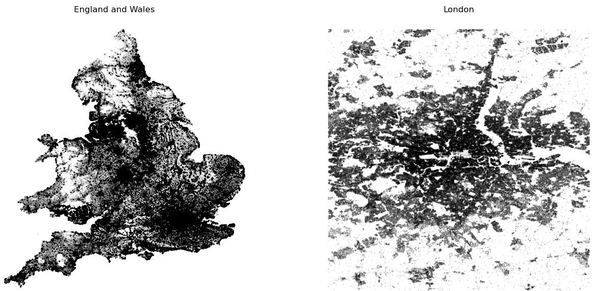
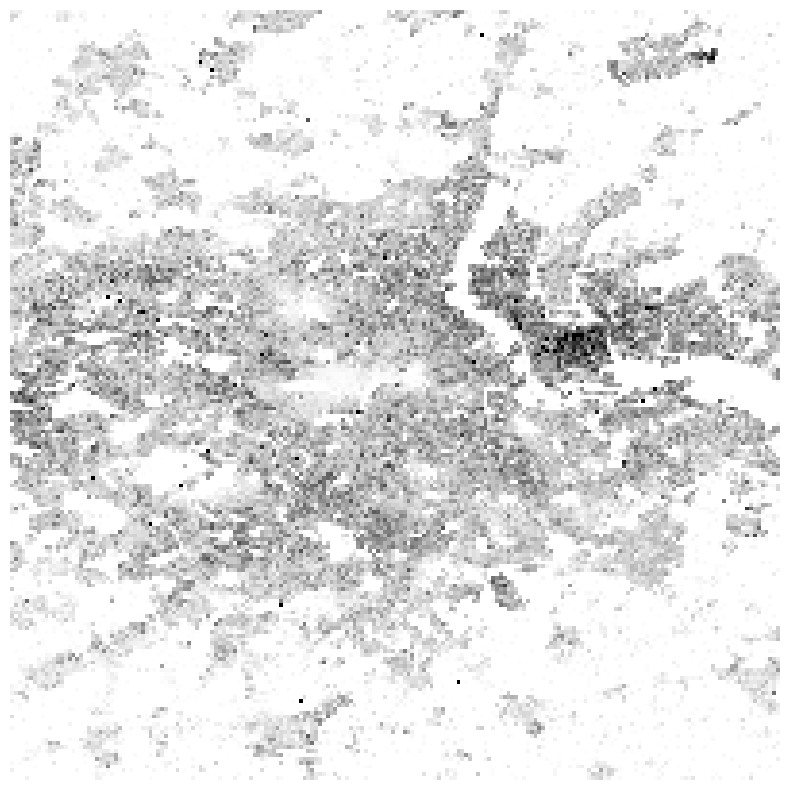
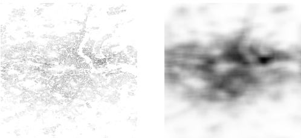
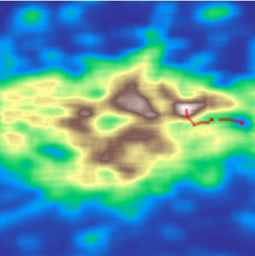
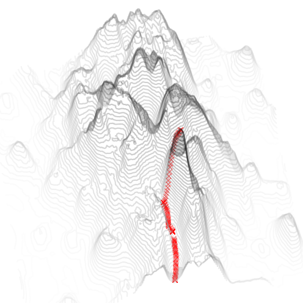

# Demographic Marble on London
### Background
Daydreaming, I imagined dropping a marble onto a heatmap of London. Normally if you drop something on a flat surface, it is unexciting; however I imagined that the most populous areas would be the most elevated in this 3d heatmap. Hence, I could simulate a marble tracing the route of fastest escape to the countryside.

### Getting data
I used the [2011 census data](https://www.ons.gov.uk/peoplepopulationandcommunity/populationandmigration/populationestimates/datasets/2011censusheadcountsandhouseholdestimatesforpostcodesinenglandandwales) for headcounts per postcode. Using the FreeMapTools [postcode lookup table](https://www.freemaptools.com/download-uk-postcode-lat-lng.htm) I obtained the latitude and longitude data for England and Wales. 

What remained was a matter of taking a weighted average of each postcode falling into a single bin of my 2D histogram. This gave a matrix I could work with:

### Simulating descent
To avoid the marbles getting stuck in pits (unpopulated parks), smoothing was necessary:

Unfortunately, the marble would still get stuck. I tweaked the algorithm to allow it to jump (use a larger step size) to reach a lower point when it failed to move between iterations.

Solving this, I could finally drop the marble!

